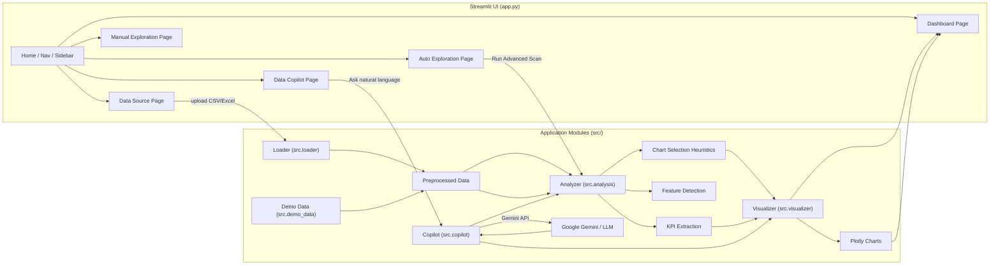
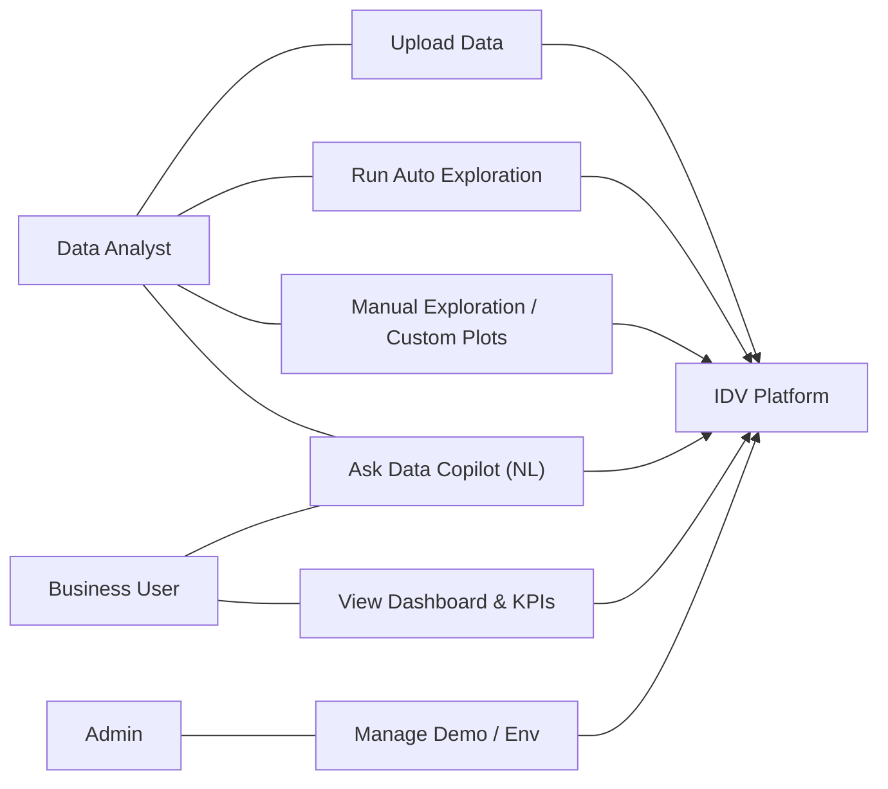
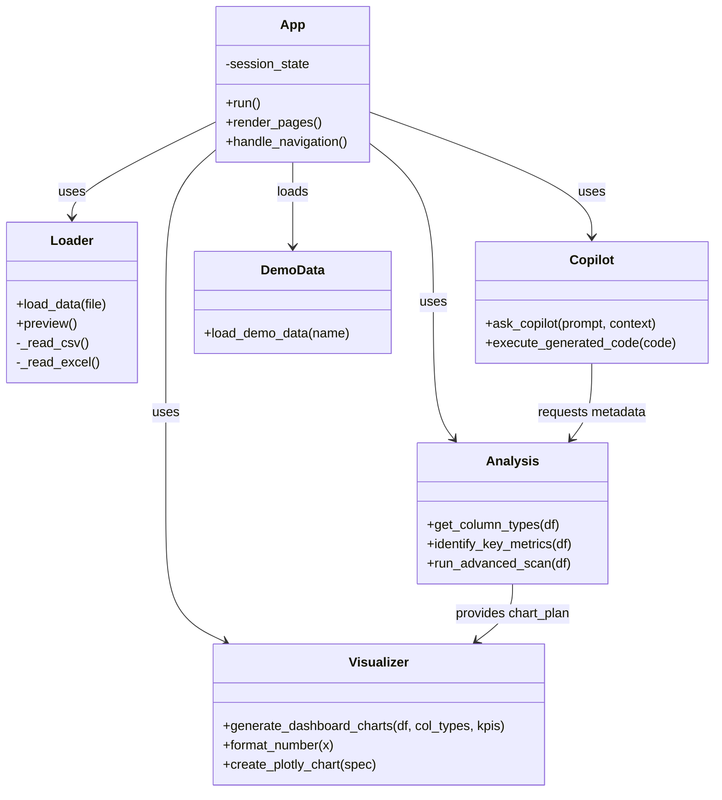
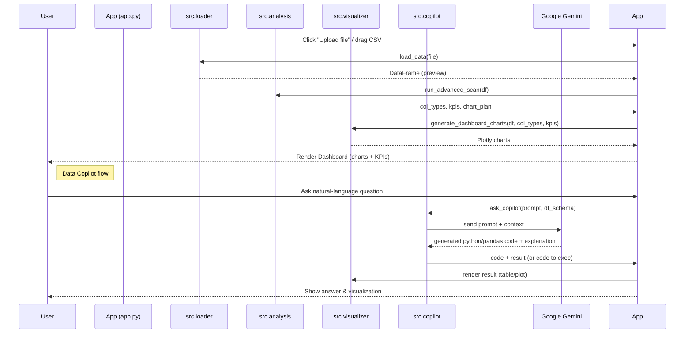
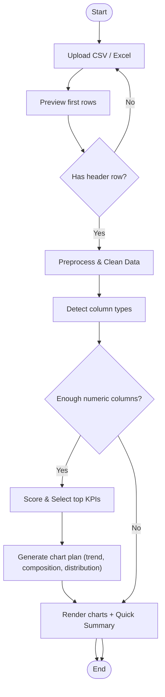

# Intelligent Data Visualization Platform

Welcome to the **Intelligent Data Visualization Platform**, a comprehensive tool designed to simplify data analysis. With features like **Auto Exploration**, **Data Copilot** (powered by Google Gemini), and dynamic **Dashboards**, turning raw data into actionable insights has never been easier.

## 🚀 Features

- **📂 Multi-Format Support**: Upload CSV or Excel files seamlessly.
- **📊 Auto Exploration**: Automatically generate key insights, trends, and distributions with a single click.
- **🤖 Data Copilot**: Interact with your data using natural language. Ask questions like "What is the total revenue?" or "Show me the top 5 products" and get code-backed answers.
- **🔍 Manual Exploration**: Dive deep into your data by creating custom scatter plots and analyses.
- **📉 Interactive Dashboard**: A unified view of your most important metrics and KPIs, complete with global filters.

## 🏗️ System Architecture

The platform is built using a modular architecture to ensure scalability and maintainability.


### Components
- **`app.py`**: The main entry point. It handles the UI layout, navigation state, and user interactions.
- **`src.loader`**: Responsible for reading and preprocessing CSV and Excel files.
- **`src.analysis`**: Performs data profiling, type detection (numerical vs. categorical), and identifies Key Performance Indicators (KPIs).
- **`src.visualizer`**: Generates Plotly charts for the dashboard and exploration views.
- **`src.copilot`**: Connects to the Google Gemini API to interpret user queries and generate pandas code for answers.

## 🛠️ Installation & Setup

1.  **Clone the Repository**
    ```bash
    git clone <repository-url>
    cd data-viz-platform
    ```

2.  **Create a Virtual Environment**
    ```bash
    python -m venv venv
    # Windows
    .\venv\Scripts\activate
    # macOS/Linux
    source venv/bin/activate
    ```

3.  **Install Dependencies**
    ```bash
    pip install -r requirements.txt
    ```

4.  **Configure Environment Variables**
    Create a `.env` file in the root directory and add your Google Gemini API key:
    ```env
    GEMINI_API_KEY=your_api_key_here
    ```

## ▶️ Usage

Run the application using Streamlit:
```bash
streamlit run app.py
```


For a detailed walkthrough of features, please refer to the [User Guide](USER_GUIDE.md).

> ✨ **Developer Note**: If you are a developer, you will love reading the [Technical Reference](TECHNICAL_REFERENCE.md) for a deep dive into the architecture and algorithms.

## Author
Built and maintained by **Muzammil**.

## Attribution
If you use or adapt this project, please give credit by linking back to this repository.

## Demo Pictures 


# Project Diagrams (Intelligent Data Visualization)

Below are five diagrams that explain the system architecture and flows of the Intelligent Data Visualization platform.
Paste these Mermaid blocks directly into your README.md (or another markdown file) — GitHub supports rendering Mermaid diagrams inline.

## Figure 1 — System Architecture


## Figure 2 — Use Case Diagram


## Figure 3 — Class Diagram


## Figure 4 — Sequence Diagram


## Figure 5 — Activity Diagram (Auto Exploration)


  
  class Backend,L,AN,V,CP,Demo backend;
